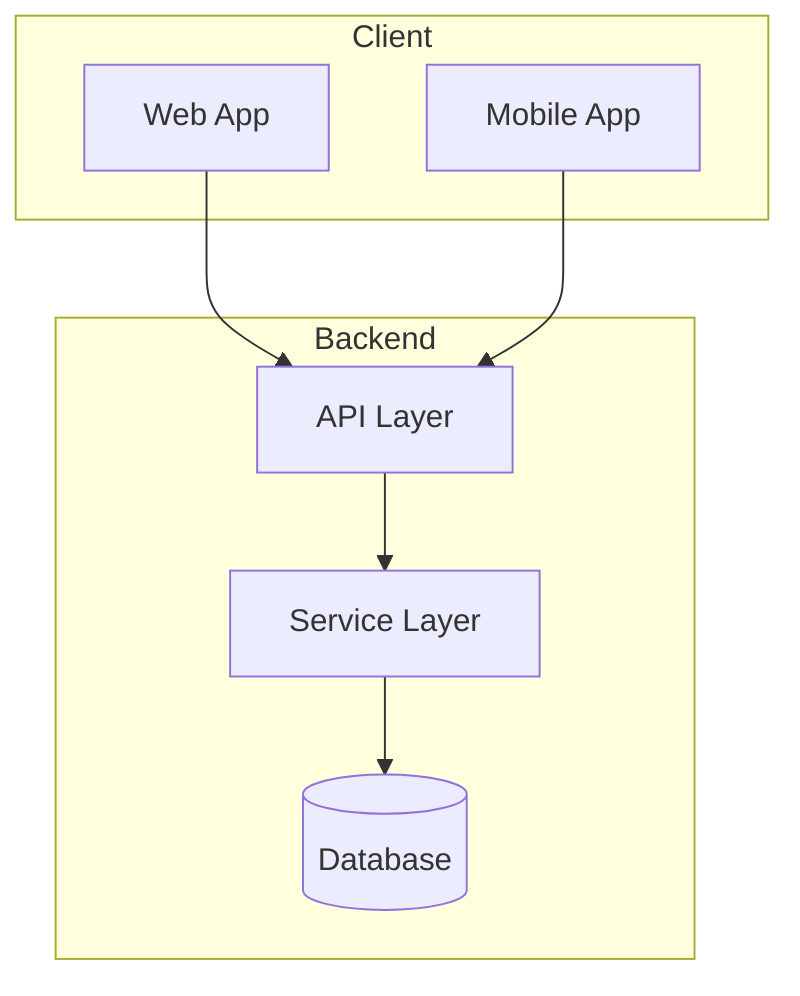
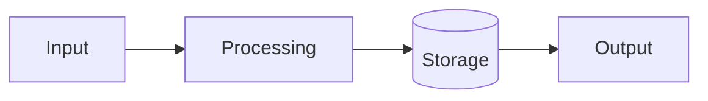
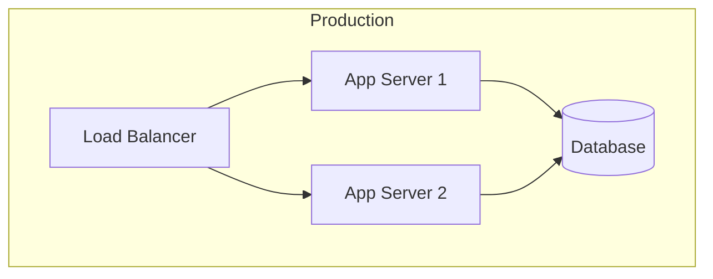

# 02-architecture-and-tech-stack.md

**Architecture & Technology Stack**

> **Audience:** Engineers, architects, Claude Code
> **Authority:** Master Source-of-Truth (Tier 2)
> **Persona:** System Architect
> **Purpose:** Define HOW the system is built

---

## 1. Purpose of This Document

This document defines the **technical architecture** and **technology choices**.

It answers:
* How is the system structured?
* What technologies are used?
* How do components interact?
* What patterns are employed?

📌 This document does NOT cover:
* What the system is (see `01-system-overview.md`)
* Security implementation (see `03-security-auth-and-access.md`)
* Development workflow (see `04-development-standards-and-structure.md`)

---

## 2. High-Level Architecture

<!-- CUSTOMIZE: Add your architecture diagram -->

### Architecture Style
<!-- CUSTOMIZE: Describe your architecture style -->
[e.g., Microservices, Monolith, Event-driven, Layered]

---

## 3. Technology Stack

### Core Technologies

<!-- CUSTOMIZE: List your technologies -->

| Category | Technology | Version | Purpose |
|----------|------------|---------|---------|
| Language | [e.g., Python] | [3.11] | [Backend services] |
| Framework | [e.g., FastAPI] | [0.100+] | [API framework] |
| Database | [e.g., PostgreSQL] | [15] | [Primary datastore] |
| Cache | [e.g., Redis] | [7] | [Session/caching] |
| Message Queue | [e.g., RabbitMQ] | [3.12] | [Async processing] |

### Frontend Technologies

| Category | Technology | Version | Purpose |
|----------|------------|---------|---------|
| Framework | [e.g., React] | [18] | [UI framework] |
| Build Tool | [e.g., Vite] | [5] | [Build/dev server] |
| Styling | [e.g., TailwindCSS] | [3] | [CSS framework] |

### Infrastructure

| Category | Technology | Purpose |
|----------|------------|---------|
| Containers | [e.g., Docker] | [Containerization] |
| Orchestration | [e.g., Kubernetes] | [Container orchestration] |
| CI/CD | [e.g., GitHub Actions] | [Automation] |

---

## 4. Component Architecture

<!-- CUSTOMIZE: Describe your components -->

### Component 1: [Name]

**Purpose:** [What it does]

**Responsibilities:**
* [Responsibility 1]
* [Responsibility 2]

**Dependencies:**
* [Dependency 1]
* [Dependency 2]

### Component 2: [Name]

**Purpose:** [What it does]

**Responsibilities:**
* [Responsibility 1]
* [Responsibility 2]

---

## 5. Data Architecture

### Data Flow

<!-- CUSTOMIZE: Add your data flow diagram -->

### Data Models

<!-- CUSTOMIZE: Describe key data entities -->

| Entity | Description | Key Fields |
|--------|-------------|------------|
| [Entity 1] | [Description] | [field1, field2] |
| [Entity 2] | [Description] | [field1, field2] |

### Database Schema

<!-- CUSTOMIZE: Reference or describe schema -->

Schema documentation: [link or description]

---

## 6. Integration Architecture

### External Integrations

<!-- CUSTOMIZE: List external integrations -->

| System | Protocol | Purpose | Auth Method |
|--------|----------|---------|-------------|
| [System 1] | REST | [Purpose] | API Key |
| [System 2] | GraphQL | [Purpose] | OAuth2 |

### Internal Communication

<!-- CUSTOMIZE: Describe internal communication -->

| From | To | Method | Purpose |
|------|-----|--------|---------|
| [Component A] | [Component B] | [HTTP/gRPC/Event] | [Purpose] |

---

## 7. Architectural Patterns

<!-- CUSTOMIZE: Document patterns used -->

### Pattern 1: [Name]

**Description:** [What it is]

**Where Used:** [Components/features using it]

**Benefits:** [Why we use it]

### Pattern 2: [Name]

**Description:** [What it is]

**Where Used:** [Components/features using it]

---

## 8. Service Ports & Endpoints

<!-- CUSTOMIZE: List your services -->

| Service | Port | Purpose |
|---------|------|---------|
| [Service 1] | [8000] | [API server] |
| [Service 2] | [5432] | [Database] |
| [Service 3] | [6379] | [Cache] |

---

## 9. Deployment Architecture

<!-- CUSTOMIZE: Add deployment diagram -->

---

## 10. References

| Source Document | Sections Used | Summary |
|-----------------|---------------|---------|
| | | |

---

## Version History

| Version | Date | Author | Changes |
|---------|------|--------|---------|
| 1.0.0 | YYYY-MM-DD | [Author] | Initial version |
