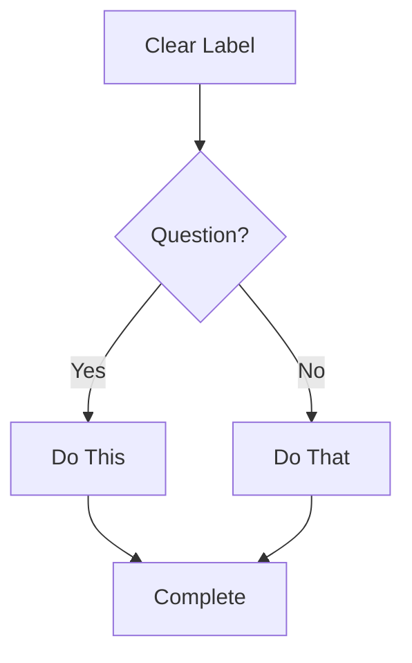

# Documentation Style Standards

**Purpose:** Define how all documentation should be written across projects.
**Authority:** Referenced by governance; applies to all tiers of documentation.
**Audience:** Claude Code, technical writers, developers, agents.

---

## Critical Rules

### Rule 1: CommonMark Strict Compliance

ALL documentation MUST follow the CommonMark specification exactly. No exceptions.

### Rule 2: No Time Estimates

NEVER document time estimates, durations, or completion times for any workflow, task, or activity. This includes:
- Workflow execution time
- Task duration estimates
- Reading time estimates
- Implementation time ranges

**Why:** Time varies dramatically based on project complexity, team experience, tooling, and unforeseen blockers.

**Instead:** Focus on steps, dependencies, and outputs. Let users determine their own timelines.

### Rule 3: Task-Oriented Writing

Write for user GOALS, not feature lists:
- Start with WHY, then HOW
- Every doc answers: "What can I accomplish?"
- Structure around tasks users want to complete

---

## CommonMark Essentials

### Headers

```markdown
# Good: ATX-style with space
## Good: Proper hierarchy
### Good: Don't skip levels

#Bad: No space after hash
## Bad: Trailing hashes ##
#### Bad: Skipped h3 level
```

**Rules:**
- Use ATX-style ONLY: `#`, `##`, `###` (NOT Setext underlines)
- Single space after `#`: `# Title` (NOT `#Title`)
- No trailing `#`: `# Title` (NOT `# Title #`)
- Hierarchical order: Don't skip levels (h1→h2→h3, not h1→h3)

### Code Blocks

````markdown
```typescript
// Good: Fenced block with language identifier
const example = 'code';
```

    // Bad: Indented code block (ambiguous)
    const example = 'code';
````

**Rules:**
- Always use fenced code blocks with language identifier
- Never use indented code blocks

### Lists

```markdown
Good: Consistent markers
- Item one
- Item two
- Item three

Good: Nested with proper indentation
- Parent item
  - Child item (2 spaces)
  - Another child

Bad: Mixed markers
- Item one
* Item two
+ Item three
```

**Rules:**
- Consistent markers within list (all `-` or all `*`)
- Proper indentation for nested items (2 or 4 spaces, consistent)
- Blank line before/after list for clarity

### Links

```markdown
Good: Descriptive link text
See the [API reference](./api-reference.md) for details.

Good: Reference style for repeated links
Read the [installation guide][install] first.
[install]: ./guides/installation.md

Bad: Bare URL
https://example.com/docs

Bad: Non-descriptive text
Click [here](./docs.md) for more info.
```

**Rules:**
- Use descriptive link text (NOT "click here")
- Use reference-style for repeated links
- Wrap bare URLs in `<>` brackets: `<https://example.com>`

### Emphasis

```markdown
Good: Consistent style
*italic text* for emphasis
**bold text** for strong emphasis

Bad: Mixed styles in same document
*italic* and _also italic_
**bold** and __also bold__
```

**Rules:**
- Pick one style per document: `*italic*` or `_italic_`
- Pick one style per document: `**bold**` or `__bold__`
- Stay consistent throughout

---

## Mermaid Diagrams

### Critical Rules

1. Always specify diagram type on first line
2. Use valid Mermaid v10+ syntax
3. Validate syntax mentally before outputting
4. Keep focused: 5-10 nodes ideal, maximum 15

### Diagram Type Selection

| Type | Use For |
|------|---------|
| `flowchart` | Process flows, decision trees, workflows |
| `sequenceDiagram` | API interactions, message flows, time-based |
| `classDiagram` | Object models, class relationships |
| `erDiagram` | Database schemas, entity relationships |
| `stateDiagram-v2` | State machines, lifecycle stages |
| `gitGraph` | Branch strategies, version control flows |

### Valid Syntax Example

````markdown

````

### Common Mistakes

| Mistake | Correct |
|---------|---------|
| No diagram type | Start with `flowchart TD` |
| Unquoted special chars | Quote labels: `A["Label: with colon"]` |
| Missing arrow type | Use `-->` not `->` for flowcharts |
| Undefined nodes | Define all nodes before connecting |

---

## Style Guide Principles

### Hierarchy

Apply style guidance in this order:
1. **Project-specific guide** (if exists in project docs)
2. **This document** (standard baseline)
3. **Google Developer Docs style** (defaults)
4. **CommonMark spec** (when in doubt)

### Voice and Tense

| Use | Don't Use |
|-----|-----------|
| Active voice: "Click the button" | Passive: "The button should be clicked" |
| Present tense: "The function returns" | Future: "The function will return" |
| Direct language: "Use X for Y" | Indirect: "X can be used for Y" |
| Second person: "You configure" | Third person: "Users configure" |

### Structure

- One idea per sentence
- One topic per paragraph
- Headings describe content accurately
- Examples follow explanations

### Accessibility

| Standard | Requirement |
|----------|-------------|
| Link text | Descriptive: "See the API reference" NOT "Click here" |
| Images | Include alt text describing what it shows |
| Headings | Semantic hierarchy (don't skip levels) |
| Tables | Always include headers |
| Color | Don't rely solely on color for meaning |

---

## API Documentation Standards

### Required Elements

Every API endpoint must document:

- [ ] Endpoint path and HTTP method
- [ ] Authentication requirements
- [ ] Request parameters (path, query, body) with types
- [ ] Request example (realistic, working)
- [ ] Response schema with types
- [ ] Response examples (success AND common errors)
- [ ] Error codes and meanings

### OpenAPI Compliance

- Follow OpenAPI 3.0+ specification
- Complete schemas (no missing fields)
- Examples that actually work
- Clear error messages
- Security schemes documented

### Example Quality

```json
// Good: Realistic, working example
{
  "email": "jane.doe@example.com",
  "name": "Jane Doe",
  "role": "developer"
}

// Bad: Generic placeholders
{
  "email": "string",
  "name": "string",
  "role": "string"
}
```

---

## Documentation Types

### README

**Requirements:**
- What (overview), Why (purpose), How (quick start)
- Installation, Usage, Contributing, License
- Under 500 lines (link to detailed docs)

### API Reference

**Requirements:**
- Complete endpoint coverage
- Request/response examples
- Authentication details
- Error handling
- Rate limits if applicable

### User Guide

**Requirements:**
- Task-based sections ("How to...")
- Step-by-step instructions
- Screenshots/diagrams where helpful
- Troubleshooting section

### Architecture Docs

**Requirements:**
- System overview diagram (Mermaid)
- Component descriptions
- Data flow
- Technology decisions (ADRs)
- Deployment architecture

### Feature Specifications

**Requirements:**
- Problem statement
- Solution overview
- Technical design
- Acceptance criteria
- Edge cases and error handling

---

## Quality Checklist

Before finalizing ANY documentation:

### Format
- [ ] CommonMark compliant (no violations)
- [ ] Headers in proper hierarchy
- [ ] All code blocks have language tags
- [ ] Links work and have descriptive text
- [ ] Mermaid diagrams render correctly
- [ ] Tables have headers

### Content
- [ ] NO time estimates anywhere
- [ ] Task-oriented (answers "how do I...")
- [ ] Active voice, present tense
- [ ] Examples are concrete and working
- [ ] Error scenarios covered

### Quality
- [ ] Spelling/grammar checked
- [ ] Accessibility standards met
- [ ] Reads clearly at target skill level
- [ ] No ambiguous pronouns or references

---

## Project-Specific Conventions

### File Organization

- `README.md` at root of each major component
- `.claude/reference/` for master documentation
- `.claude/features/` for feature specifications
- Cross-references use relative paths

### Frontmatter

Use YAML frontmatter when appropriate:

```yaml
---
title: Document Title
description: Brief description
version: 1.0.0
last_updated: YYYY-MM-DD
---
```

### Reference Table Format

When master documents reference processed docs:

```markdown
| Source Document | Sections Used | Summary |
|-----------------|---------------|---------|
| `architecture/overview.md` | §2, §3.1 | System components |
```

---

## Remember

> Documentation is teaching. Every doc should help someone accomplish a specific task, not just describe features.

> Clarity above all. Use plain language, structured content, and visual aids to make complex topics accessible.

> Documentation is a living artifact. It evolves with the codebase. Advocate for docs-as-code practices.

---

**This document governs all documentation writing. Follow these rules consistently.**
