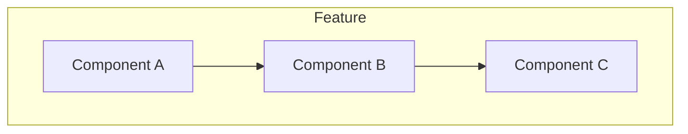
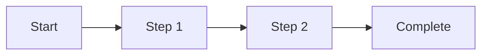

# Feature Specification: [Feature Name]

**Version:** 1.0.0
**Status:** [Draft | In Review | Approved | Implemented]
**Author:** [Author Name]
**Date:** YYYY-MM-DD

---

## 1. Overview

### Summary
[One paragraph describing what this feature does and why it matters]

### Problem Statement
[What problem does this feature solve? Why is it needed?]

### Goals
- [ ] [Goal 1]
- [ ] [Goal 2]
- [ ] [Goal 3]

### Non-Goals (Out of Scope)
- [Explicitly what this feature will NOT do]
- [Boundary conditions]

---

## 2. User Stories

### Primary User Story
```
As a [user type]
I want to [action]
So that [benefit/outcome]
```

### Additional Stories
| ID | As a... | I want to... | So that... |
|----|---------|--------------|------------|
| US-1 | [user] | [action] | [benefit] |
| US-2 | [user] | [action] | [benefit] |

---

## 3. Functional Requirements

### FR1: [Requirement Name]
**Description:** [What the system must do]
**Priority:** [Must | Should | Could]
**Acceptance Criteria:**
```gherkin
Given [precondition]
When [action]
Then [expected result]
```

### FR2: [Requirement Name]
**Description:** [What the system must do]
**Priority:** [Must | Should | Could]
**Acceptance Criteria:**
```gherkin
Given [precondition]
When [action]
Then [expected result]
```

---

## 4. Non-Functional Requirements

| ID | Category | Requirement | Target |
|----|----------|-------------|--------|
| NFR1 | Performance | [Description] | [Metric] |
| NFR2 | Security | [Description] | [Standard] |
| NFR3 | Scalability | [Description] | [Metric] |

---

## 5. Technical Design

### Architecture



### Data Model

| Entity | Fields | Description |
|--------|--------|-------------|
| [Entity] | [field1, field2] | [Purpose] |

### API Endpoints

| Method | Endpoint | Description |
|--------|----------|-------------|
| POST | `/api/v1/resource` | Create resource |
| GET | `/api/v1/resource/:id` | Get resource |

### Dependencies
- [Dependency 1]: [Why needed]
- [Dependency 2]: [Why needed]

---

## 6. UI/UX Design

### Wireframes
[Link to wireframes or embed images]

### User Flow



### Edge Cases
| Scenario | Expected Behavior |
|----------|-------------------|
| [Empty state] | [What user sees] |
| [Error state] | [What user sees] |
| [Loading state] | [What user sees] |

---

## 7. Testing Strategy

### Test Cases

| ID | Type | Description | Priority |
|----|------|-------------|----------|
| TC1 | Unit | [Description] | P0 |
| TC2 | Integration | [Description] | P1 |
| TC3 | E2E | [Description] | P1 |

### Edge Cases to Test
- [ ] [Edge case 1]
- [ ] [Edge case 2]
- [ ] [Negative case]

---

## 8. Rollout Plan

### Phases
1. **Phase 1:** [Description]
2. **Phase 2:** [Description]

### Feature Flags
| Flag | Purpose | Default |
|------|---------|---------|
| `feature_x_enabled` | Enable new feature | false |

### Rollback Plan
[How to rollback if issues occur]

---

## 9. Security Considerations

- [ ] Authentication required
- [ ] Authorization checks
- [ ] Input validation
- [ ] Data encryption
- [ ] Audit logging

---

## 10. Open Questions

| Question | Answer | Status |
|----------|--------|--------|
| [Question 1] | [Answer] | [Open/Resolved] |
| [Question 2] | [Answer] | [Open/Resolved] |

---

## 11. References

| Document | Link |
|----------|------|
| PRD | [Link] |
| Design | [Link] |
| Related ADR | [Link] |

---

## Version History

| Version | Date | Author | Changes |
|---------|------|--------|---------|
| 1.0.0 | YYYY-MM-DD | [Author] | Initial version |
